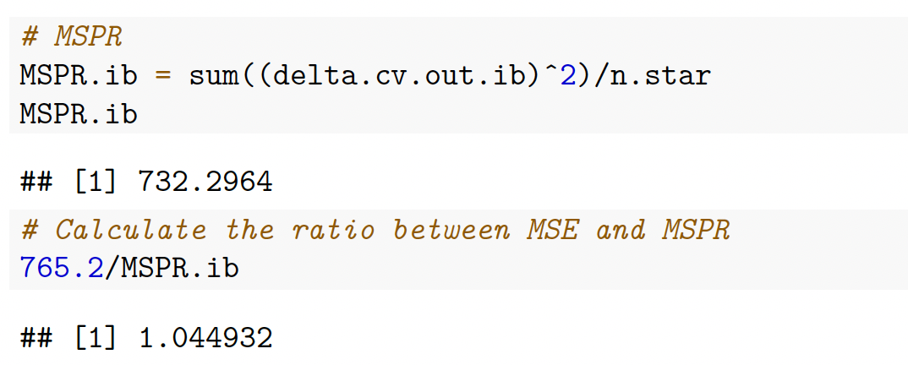
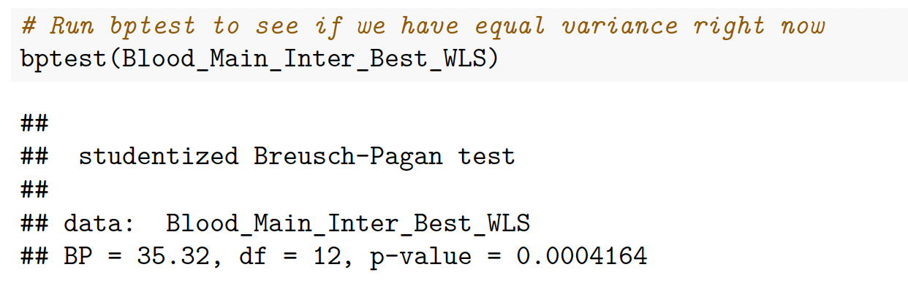

```{r, setup, include=FALSE}
knitr::opts_chunk$set(fig.height = 5)
```
<font size= '3'>**Suprrvisor: Dr. Sohee Kang (sohee.kang@utoronto.ca)**</font>    
<font size= '3'>University of Toronto Scarborough</font>  
<font size= '3'>Toronto, Ontario, Canada</font>    
<font size= '3'>{ yunrong.liu, yulunbblythe.wu, yuanxin.su }@mail.utoronto.ca</font>     

<br />
<font size= '1'>**Yunrong Liu** (1005732735): Schedule the case study, help coding, Consulting the supervisor, write the report.  
**Yulun Wu** (1004912785): Do the presentation of the case study, do the coding, writing the report.  
**Yuanxin Su** (1005754015): Do the coding.\newpage  
<font size= '3'>**RESEARCH BACKGROUND DESCRIPTION**</font>          
<font size= '1'>Systolic blood pressure is the pressure exerted when the heartbeats and blood is ejected into the arteries. Researchers want to find out what determines systolic blood pressure. Researchers want to find out what determines the systolic blood pressure, so we can prevent diseases such as hypertension.</font>  
<br />  
<font size= '3'>**GOAL OF STUDY**</font>  
<font size= '1'>The aim of this study is to determine which factors have impact on systolic blood pressure (SBP). We will analyze the relationship between SBP and gender, marital status, smoking status, age, weight, height, Body Mass Index (BMI), overweight status, race, exercise level, alcohol use, stress level, salt (NaCl) intake level, childbearing potential, income level, education level, treatment (for hypertension) status. We will come up with a model to predict SBP given selected predictors.</font>  
<br />  
<font size= '3'>**RESEARCH OBJECTIVE**</font>  
<font size= '1'>Analyze the factors that determine the systolic blood pressure of the human body. Building a statistical model. Then optimal the model uses *AIC(1974)*^[2]^. Do the model diagnostic about outlying points, influential points, multicollinearity problems and regression assumptions. The final model should give an acceptable accuracy rate.</font>  
<br />  
<font size= '3'>**DATA DESCRIPTION**</font>   
Based on the dataset *Factors Affecting Systolic Blood Pressure (SBP) *^1^:  
<font size= '2'>**Categorical Data:**</font>  
    <font size= '1'>Gender: sex of the observee (M=Male, F=Female)
Marital/Smoking Status: whether the observee is married/smokes  
Overweight: whether the observee is overweight (1=Normal, 2=Overweight, 3=Obese)  
Race: observee’s race 
Exercise level: how much exercise the observee does (1=low, 2=medium, 3=high)
Alcohol Use: alcohol drinking level of the observee (1=low, 2=medium, 3=high).
Stress Level: the stress level of the observee (1=low, 2=medium, 3=high)
Salt(NaCl) Intake Level: the level of salt intake of the observee in diet (1=low, 2=medium, 3=high)
Childbearing Potential: whether the observee is capable to pregnant (1=Male, 2=Able Female, 3=Unable Female)
Income/Education Level: the level of observee’s income/education (1=low, 2=medium, 3=high)  
Treatment: whether the  is treated for hypertension </font>  
<font size= '2'>**Quantitative Data:**</font>   
<font size= '1'>SBP: Systolic Blood Pressure. This is response variable
Age : age of the observee (in years)
Weight : the observee’s weight (in lbs)
Height: the height of the observee (in inches)
BMI : the Body Mass Index of the observee, is calculated by (weight/$height^2$) x 703</font>  
<br />  
<font size= '3'>**GENERAL RESEARCH DESIGN**</font>     
<font size= '1'>1. Cleaning the data. 2.	Fit the regression model with main effects only and do validation. 3. Consider interaction and use *AIC(1974)*^[2]^ method to find the optimal model. 4. Model Selection Decision. 5. Do the model diagnostic about outlying points, influential points, multicollinearity problem and regression assumptions. 6. Decide final Model. 7. Test the accuracy of our final model. 8. Discuss result, limitations and the future work can be done.</font>  
<br />  
<font size= '3'>**STEP 1: CLEANING DATA**</font>  
<font size= '1'>We need to clean the data before we start the actual model building process. We create dummy variables for 13 categorical variables in our dataset. We also separate the data into training set and validation set for the validation later on.</font>
```{r, echo=FALSE, results='hide', warning=FALSE, message=FALSE}
library(tidyverse)
library(readxl)
library(GGally)
library(MPV)
library(ggpubr)
library(olsrr)
library(car)
library(lmtest)
```

```{r,results='hide'}
# Read Excel table
BloodPressure = read_excel("BloodPressure.xlsx")
```
```{r, echo=FALSE, results='hide'}
a = head(BloodPressure,20)
a
# out put first 20 line to observation
```  
<br />
```{r, results='hide',echo=FALSE}
# Create dummy variables for categorical variables
BloodPressure %>%
  mutate(gender = factor(gender), 
         married = factor(married),
         smoke = factor(smoke),
         exercise = factor(exercise),
         overwt = factor(overwt),
         race = factor(race),
         alcohol = factor(alcohol),
         trt = factor(trt),
         stress = factor(stress),
         salt = factor(salt),
         chldbear = factor(chldbear),
         income = factor(income),
         educatn = factor(educatn),
         ) -> BloodPressure
```
```{r,echo=FALSE,results='hide'}
data.frame(mean(BloodPressure$sbp),mean(BloodPressure$height),mean(BloodPressure$weight),mean(BloodPressure$bmi),mean(BloodPressure$age))
data.frame(sd(BloodPressure$sbp),sd(BloodPressure$height),sd(BloodPressure$weight),sd(BloodPressure$bmi),sd(BloodPressure$age))
```
```{r echo=FALSE, out.width ='50%', warning = FALSE}


```

```{r, results='hide',echo=FALSE}
# Separate data into training set and validation set, each contain 250 observations.
set.seed(1005732735)
BloodPressure.cv.samp = base::sample(1:500, size = 250, replace=FALSE)
BloodPressure.cv.train =BloodPressure[BloodPressure.cv.samp,] 
BloodPressure.cv.vali =BloodPressure[-BloodPressure.cv.samp,]
# BloodTrain is training set, BloodValid  is validation set
BloodTrain = BloodPressure.cv.train
BloodValid = BloodPressure.cv.vali
```
<font size= '1'>We generate the Scatter plot and correlation matrix for response variable and quantitative variables in training set. We want to see if we need to consider polynomial regression and if we can find any high correlation variable to drop before fitting the model.</font>
```{r, results='hide', fig.show='hide',echo=FALSE}
# Scatter plot and correlation matrix of response variable and quantitative variables in training set 
ggpairs(BloodTrain,columns = c(1,6,7,8,13))
```
```{r echo=FALSE, out.width ='40%', warning = FALSE}

```

<font size= '1'>There is a linear relationship between bmi and height, bmi and weight, but their correlations are -0.583 and 0.778 which are less than +-0.9, we don't regard them as highly correlated terms, so we keep them.  
Response variable v.s. any quantitative variables don't show evidence of the polynomial relationship, so we don't need to consider polynomial regression in our model.</font>  
<br />  
<font size= '3'>**STEP 2: FIT THE REGRESSION MODEL WITH THE MAIN EFFECT ONLY AND DO VALIDATION**</font>  
<font size= '1'> First, we fit all main effects into the model, this is definitely not the best model, we will use stepwise elimination to eliminate main effects later.</font>
```{r, results='hide',echo=FALSE}
# Fit model with training, first use all main effects
Blood_Main_All = lm(sbp~., data = BloodTrain)
```
```{r, results='hide',echo=FALSE}
#Blood_Main_Best is obly main effect AIC
Blood_Main_Best = step(Blood_Main_All, direction = 'both')
```
<font size= '1'> We apply stepwise elimination to our model. This is our best model with main effects only.</front>
```{r echo=FALSE, out.width ='40%', warning = FALSE}

```  

<font size= '1'>The following are the validation of this model.</front>
```{r, results='hide',echo=FALSE}
# Note that validation set is called: BloodValid
# Validation process
anova(Blood_Main_Best)
pred.cv.out = predict(Blood_Main_Best,BloodValid[,c(4,5,8,11,12,13)])
delta.cv.out =BloodPressure$sbp[-BloodPressure.cv.samp]-pred.cv.out
n.star=dim(BloodValid)[1]
```
```{r echo=FALSE, out.width ='70%', warning = FALSE}

```  

<font size= '1'>This picture shows the MSE of this model.</front>
```{r echo=FALSE, out.width ='50%', warning = FALSE}

```
```{r,echo=FALSE,results='hide'}
# MSPR
MSPR = sum((delta.cv.out)^2)/n.star
MSPR
# Calculate the ratio between MSPR and MSE
MSPR/560.9
```
```{r echo=FALSE, out.width ='70%', warning = FALSE}

```  
```{r echo=FALSE, out.width ='70%', warning = FALSE}

```  

<font size= '1'>The ratio between MSPR and MSE is less than 3, we say MSE is close to MSPR, so validate this model.</front>
```{r,echo=FALSE,results='hide'}
# PRESS statistic
PRESS(Blood_Main_Best)
```
```{r echo=FALSE, out.width ='70%', warning = FALSE}

```  
<br />  
<font size= '3'>**STEP 3: ADD INTERACTION TERMS INTO THE MODEL, USE *AIC(1974)*^[2]^ AND DO VALIDATION**</font>  
<font size= '1'> Then, we add interaction terms to the best model we find in step 2, use stepwise elimination to eliminate the predictors and do validation for the eliminated model.</font>
```{r, results='hide',echo=FALSE}
# Pick out data of selected main effects
BloodTrain %>%
  select(c(smoke,exercise,height,alcohol,trt,bmi,sbp)) -> BloodTrain_main

# Add interaction terms
Blood_Main_Inter_All = lm(sbp~.^2, data=BloodTrain_main)

# Use stepwise elimination to eliminate the predictors
Blood_Main_Inter_Best = step(Blood_Main_Inter_All,direction = "both")

# This is our best model after adding interaction terms
summary(Blood_Main_Inter_Best)
```
```{r echo=FALSE, out.width ='40%', warning = FALSE}

```

<font size= '1'>The following are the validation of this model.</front>
```{r,results='hide',echo=FALSE}
# Validation for this model
anova(Blood_Main_Inter_Best)
pred.cv.out.i = predict(Blood_Main_Inter_Best,BloodValid[,c(4,5,8,11,12,13)])
delta.cv.out.i =BloodPressure$sbp[-BloodPressure.cv.samp]-pred.cv.out.i
n.star=dim(BloodValid)[1]
```
<font size= '1'>This picture shows the MSE of this model.</front>
```{r echo=FALSE, out.width ='50%', warning = FALSE}

```
```{r,echo=FALSE,results='hide'}
# MSPR
MSPR.i = sum((delta.cv.out.i)^2)/n.star
MSPR.i
# Calculate the ratio between MSPR and MSE
MSPR.i/534.7
```
```{r echo=FALSE, out.width ='70%', warning = FALSE}

```  

<font size= '1'>The ratio between MSPR and MSE is less than 3, we say MSE is close to MSPR, so validate this model.</front>
```{r,echo=FALSE,results='hide'}
# PRESS statistic
PRESS(Blood_Main_Inter_Best)
```
```{r echo=FALSE, out.width ='70%', warning = FALSE}

```  
<br />  
<font size= '3'>**STEP 4: MODEL SELECTION DECISION**</font>  
<font size= '1'>We calculate PRESS statistic, Cp, and *AIC(1974)*^[2]^ for the best model with main effects only and best model adding interaction terms.</font>
```{r, results='hide',echo=FALSE}
# Create a table with PRESS statistic, Cp, and *AIC(1974)*^[2]^ for best model with main effects only and best model adding interaction terms
PRESS.v = c(PRESS(Blood_Main_Best),PRESS(Blood_Main_Inter_Best)) 
Cp.v = c(ols_mallows_cp(Blood_Main_Best, Blood_Main_All), ols_mallows_cp(Blood_Main_Inter_Best, Blood_Main_Inter_All))
AIC.v = c(AIC(Blood_Main_Best),AIC(Blood_Main_Inter_Best))
p_prime.v = c(length(Blood_Main_Best$coefficients),length(Blood_Main_Inter_Best$coefficients))
model_selection = data.frame(PRESS.v,Cp.v,p_prime.v,AIC.v)
colnames(model_selection) = c("PRESS","Cp","p'","AIC")
rownames(model_selection) = c("Blood_Main_Best","Blood_Main_Inter_Best")
model_selection
```
```{r echo=FALSE, out.width ='50%', warning = FALSE}

```  

<font size= '1'>From the table above, both models have Cp far from p', Blood_Main_Inter_Best has the minimum PRESS statistic and AIC, so we select Blood_Main_Inter_Best for model diagnosis. Notice that we don't know if this model violates any of the regression assumptions, so we can't say this is our final model, it is just the best model we have so far.</font>  
<br />  
<font size= '3'>**STEP 5: MODEL DIAGNOSIS**</font>  
<font size= '2'>**OLS Added Variable Plot**</font>  
<font size= '1'>Since we have 13 predictors in our model, we just put some of the plots here.</font>
```{r,results='hide',fig.show='hide',message=FALSE,echo=FALSE}
ols_plot_added_variable(Blood_Main_Inter_Best)
```
```{r echo=FALSE, out.width = c('40%','40%'), warning = FALSE}

```

<font size= '1'>No polynomial relationship was observed between the response variable and predictors, no need to consider polynomial regression.</font>  
<font size= '2'>**Outlying Points**</font>
```{r, results='hide',fig.show='hide',echo=FALSE}
# Find outlying points
hii = hatvalues(Blood_Main_Inter_Best)
hii = round(hii,2)
which(hii > 2*10/250)
which(hii > 0.5)
ols_plot_resid_lev(Blood_Main_Inter_Best)
```
```{r echo=FALSE, out.width = c('50%','50%'), warning = FALSE}

```

<font size= '1'>We find 37 outlying points.</front>  
<font size= '2'>**Influential Points**</font>
```{r,fig.show='hide',echo=FALSE}
# Find influential points
ols_plot_cooksd_chart(Blood_Main_Inter_Best)
```
```{r echo=FALSE, out.width = c('50%','50%'), warning = FALSE}

```

<font size= '1'>From Cook's distance chart, we can see that observations 32, 71, 116, 153, 244, and 249 cause major changes to the fitted regression model.</font>  
<font size= '2'>**Former Multicollinearity Check**</font>
```{r,echo=FALSE,results='hide'}
# Calculate *VIF*^[1]^ for each predictors
VIF = vif(Blood_Main_Inter_Best)
VIF
# Calculate VIF_bar
VIFbar = mean(VIF)
VIFbar
```
```{r echo=FALSE, out.width ='50%', warning = FALSE}

```  

<font size= '1'>We can ignore the high VIF of interaction term, because high VIF of interaction term is expected. Since trt is a categorical variable, we can ignore its high VIF as well. The rest terms all have VIF < 10, and $\bar{VIF}$ < 10, therefore, no multicollinearity problem detected in this model.</front>  
<font size= '2'>**Checking Regression Assumption**</font>
```{r,echo=FALSE,results='hide'}
## Check Normal Population Assumption uses *shapiro wilk test*^[3]^
shapiro.test(Blood_Main_Inter_Best$residuals)
```
```{r echo=FALSE, out.width ='70%', warning = FALSE}

```  

<font size= '1'>p-value = 0.08001 > 0.05, so we fail to reject the null hypothesis that the sample is from normal population.</front>
```{r,echo=FALSE,results='hide'}
# Check Equal Variance Assumption
bptest(Blood_Main_Inter_Best)
```
```{r echo=FALSE, out.width ='70%', warning = FALSE}

```  

<font size= '1'>p-value = 0.0004164 < 0.05, so we reject the null hypothesis that the residuals are distributed with equal variance. We need to apply weighted least square (WLS)</front>
```{r,fig.show='hide',results='hide',echo=FALSE}
# Apply WLS
resid = rstandard(Blood_Main_Inter_Best)
s.hat = abs(resid)
s.hat_X = lm(s.hat ~ bmi + trt + alcohol + smoke + exercise + height + 
    bmi:trt + trt:alcohol + trt:smoke, data = BloodTrain)
var.s = (predict(s.hat_X))^2
Blood_Main_Inter_Best_WLS = lm(sbp ~ bmi + trt + alcohol + smoke + exercise + height + 
    bmi:trt + trt:alcohol + trt:smoke, weights=1/var.s,data = BloodTrain)
```
```{r,results='hide',echo=FALSE}
# Validation of this WLS model
anova(Blood_Main_Inter_Best_WLS)
```
```{r,results='hide',echo=FALSE}
pred.cv.out.ib = predict(Blood_Main_Inter_Best_WLS,BloodValid[,c(4,5,8,11,12,13)])
delta.cv.out.ib =BloodPressure$sbp[-BloodPressure.cv.samp]-pred.cv.out.ib
```
```{r echo=FALSE, out.width ='70%', warning = FALSE}

```
```{r,echo=FALSE,results='hide'}
# MSPR
MSPR.ib = sum((delta.cv.out.ib)^2)/n.star
MSPR.ib
# Calculate the ratio between MSE and MSPR
765.2/MSPR.ib
```
```{r echo=FALSE, out.width ='70%', warning = FALSE}

```  

<font size= '1'>Then we apply WLS to our best model, we hide the code due to page limitations. The ratio between MSE and MSPR is less than 3, we say MSE is close to MSPR, so validate this model.</front>
```{r,echo=FALSE,results='hide'}
# Compare OLS coefficients and WLS coefficients
compare = data.frame(coefficients(Blood_Main_Inter_Best_WLS),coefficients(Blood_Main_Inter_Best))
colnames(compare) = c("WLS model","OLS model")
compare
```
```{r echo=FALSE, out.width = c('30%','30%'), warning = FALSE}

```

<font size= '1'>The coefficients of Blood_Main_Inter_Best_WLS is not significantly different from the coefficients of Blood_Main_Inter_Best.</front>
```{r,echo=FALSE,results='hide'}
# Run bptest to see if we have equal variance right now
bptest(Blood_Main_Inter_Best_WLS)
```
```{r echo=FALSE, out.width ='70%', warning = FALSE}

```  

<font size= '1'>The bptest remains the same for two model. We will talk about this problem in limitation section.</front>  
<br />  
<font size= '3'>**STEP 6: FINAL MODEL**</font>  
<font size= '1'>We compare the best model with OLS with model with WLS</font> 

```{r,results='hide',echo=FALSE}
# Validation of this WLS model
summary(Blood_Main_Inter_Best)
summary(Blood_Main_Inter_Best_WLS)
(2.75+3.2+3.67+4.0+3.67+3.77)/6
(24+(5*3.7)+(3*3.3)+6+2.7)/18
(20+(3.7*2)+9.9)/10
```
```{r echo=FALSE, out.width = c('50%','50%'), warning = FALSE}

knitr::include_graphics("R_best.png")
```

<font size= '1'>$R^2$ for Blood_Main_Inter_Best is 0.2954, and $R^2$ for Blood_Main_Inter_Best_WLS is 0.3455, we see a significant improvement in $R^2$ after applying WLS.</font>  
```{r,echo=FALSE}
PRESS.v2 = c(PRESS(Blood_Main_Inter_Best),PRESS(Blood_Main_Inter_Best_WLS))
AIC.v2 = c(AIC(Blood_Main_Inter_Best),AIC(Blood_Main_Inter_Best_WLS))
model_selection.2 = data.frame(PRESS.v2,AIC.v2)
colnames(model_selection.2) = c("PRESS","AIC")
rownames(model_selection.2) = c("Blood_Main_Inter_Best","Blood_Main_Inter_Best_WLS")
model_selection.2
```
<font size= '1'>From the table above, model with WLS has the minimum PRESS statistic and AIC, so we select model with WLS as our final model.  
<br />  
<font size= '3'>**CONCLUSION**</font>  
<font size= '1'>The equation of this model is</front>
```{r echo=FALSE, out.width = c('50%','50%'), warning = FALSE}

```

<font size= '2'>**Interpretation**</font>  
<font size= '1'>We round all numbers to two decimal places.  
$\beta_0$: When the all variables equal to 0, we expect the observee’s sbp to be 58.56.  
$\beta_1$: The observee’s sbp is expected to be increased by 1.44 if observee’s bmi is increase by 1 with holding other variables unchanged.  
$\beta_2$: The observee who receives treatment’s sbp is expected to have sbp 36.33 bigger than the observee who doesn't receive treatment, with holding other variables unchanged.  
$\beta_3$: For observee who drink a lot of alcohol, the sbp is expected to be 21.82 higher than observee who drinks little alcohol, with holding other variables unchanged. For observee who drink meduim amount of alcohol, the sbp is expected to be 2.27 higher than observee who drinks little alcohol, with holding other variables unchanged.  
$\beta_4$: The observee who smokes is expected to have sbp 36.33 bigger than the observee who doesn't smoke, with holding other variables unchanged.  
$\beta_5$: For observee who does medium amount of exercise, the sbp is expected to be 7.42 lower than observee who does low amount of exercise, with holding other variables unchanged. For observee who does high amount of exercise, the sbp is expected to be 5.25 lower than observee who does low amount of exercise, with holding other variables unchanged.  
$\beta_6$: The observee’s sbp is expected to be increased by 0.62 if observee’s height is increased by 1 inches with holding other variables unchanged.  
$\beta_7$: The observee's sbp will have additional decrease of 1.12 if the observee's bmi increased by 1 for observee who takes treatment compared to observee who doesn't take treatment with holding other variables unchanged.  
$\beta_8$: The observee's sbp will have additional decrease of 8.20 if the observee drinks meduim amount of alcohol and takes treatment compared to observee who drinks low amount of alcohol and doesn't take treatment with holding other variables unchanged. The observee's sbp will have additional decrease of 23.38 if the observee drinks high amount of alcohol and takes treatment compared to observee who drinks low amount of alcohol and doesn't take treatment with holding other variables unchanged.  
$\beta_9$: The observee's sbp will have additional decrease of 15.36 if the observee smokes and takes treatment compared to observee who doesn't smoke and doesn't take treatment with holding other variables unchanged.  
This suggest that people who doesn't take treatment for hypertension, doesn't smoke, do medium amount of exercise and drink low amount of alcohol with lower bmi and shorter height tend to have lower sbp. </front>  
<br />  
<font size= '3'>**LIMITATION**</font>  
<font size= '1'>The bptest result for our OLS model and WLS model is exactly the same. We did some research and asked TA, it turns out that probably the error is skew distributed, so WLS can’t sufficiently adjust the variance of our model. We tried another approach of WLS and get the same result. But applying WLS regression does significantly increase our $R^2$.  
The $R^2$ of our final model is 0.3455, which is not really high.</front>  
<br />  
<font size= '3'>**FUTURE WORK**</font>  
<font size= '1'>Researching on what makes us get the same bptest result and solve this problem.  
Try other regression methods and see if we can improve the R^2.  
Lack of predictor can also cause low R^2, so collecting more data and find out more potential predictor that may affect sbp.</front>  
<br />  
<font size= '3'>**REFERENCES**</font>  
<font size= '1'>[1]VIF: Snee, Ron (1981). Origins of the Variance Inflation Factor as Recalled by Cuthbert Daniel (Technical report). Snee Associates.  
[2] AIC:  Akaike, Hirotsugu. A new look at the statistical model identification. IEEE Transactions on Automatic Control. 1974, 19 (6): 716–723.  
[3] Hosmer-Lemeshow test:  Hosmer, David W.; Lemeshow, Stanley (2013). Applied Logistic Regression. New York: Wiley. ISBN 978-0-470-58247 </front>


